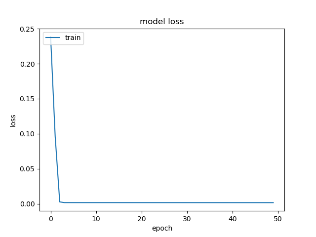
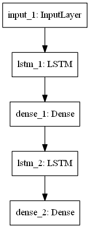
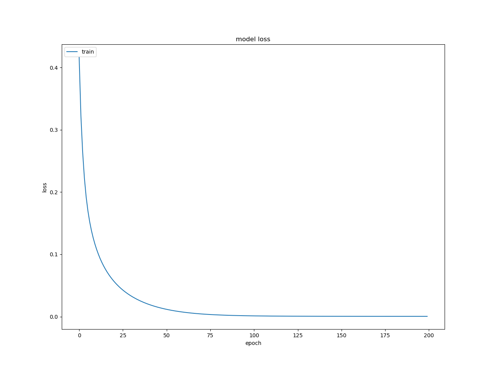

# Stock-Prediction
Group Project for Introduction to Machine Learning, Deng Zhihong, PKU

## 0. 简介
。。。
## 1. 数据
(来源，yahoo, google,....)（哪个公司，总共几天。。。）

- 采用相邻天数据变动值的对数值作为训练数据
- 采用数据的前1/4作为栈式自编码器特征提取的训练集
- 后3/4数据的前80%为LSTM网络训练集，后20%为LSTM网络测试集
  
## 2. 数据预处理
  
- 小波变换
  - 方法：先做小波变换，变换波形haar
  
  $$X_{\omega}(a,b) = \frac{1}{\sqrt{a}}\int x(t)\psi \left(\frac{t-b}{a} \right) \dt$$
  
  - 去除标准差意外的点
  - 做逆变换
```
    (ca, cd) = pywt.dwt(x, "haar")
    cat = pywt.threshold(ca, np.std(ca), mode="soft")
    cdt = pywt.threshold(cd, np.std(cd), mode="soft")
    tx = pywt.idwt(cat, cdt, "haar")
```

## 3. 栈式自编码器
-  自编码器简介。。。
- 该模型中，分为三层encoder和三层decoder，从编码到解码每一层维数为55，40，20，40，55，网络结构**如图所示**（模型在model文件夹）
  <center>
  
  
  </center>

- 训练轮数为500，采用adam优化方法（简要说明adam方法）
- 训练结果
   <center>
  
  
  </center>

## 4. LSTM
- LSTM简介。。。
- 所采用的模型如图，两层LSTM
    <center>
  
  
  </center>
- 训练轮数2000，采用adam优化方法
- 训练环境....

## 5. 结果
- 所采用的模型如图，两层LSTM
    <center>
  
  
  </center>
