# 基于LSTM-RNN的股票预测研究
刘茁 1500011438 物理学院\
胡承开 1800932142

## 0. 简介

&nbsp; &nbsp; &nbsp; &nbsp; 人们一直以来都期望可以预测股票未来价值，尽管这非常困难。这种困难源于股票的非平稳行为且没有任何明确的形式。因此，最好通过分析金融股票数据进行预测。为了处理大数据集，当前普遍使用滑动平均方法。然而，利用小波变换代替移动平均去噪股票信号，可以使金融数据更平滑，更准确地分解。

&nbsp; &nbsp; &nbsp; &nbsp;LSTM(Long Short-Term Memory)是长短期记忆网络，是一种时间递归神经网络，适合于处理和预测时间序列中间隔和延迟相对较长的重要事件。
LSTM已经在科技领域有了多种应用。通过这些方法的实施，我们可以得到更准确的股票预测，进而增加利润。

## 1. 获取股票数据
&nbsp; &nbsp; &nbsp; &nbsp;使用雅虎财经API获取，以苹果公司2000年1月1日-2019年1月1日的数据为例。共4884个样本，每个样本包括日期、开盘价、最低价、最高价、收盘价、已调整收盘价和成交量。
&nbsp; &nbsp; &nbsp; &nbsp;利用数据制作K线图

<center>
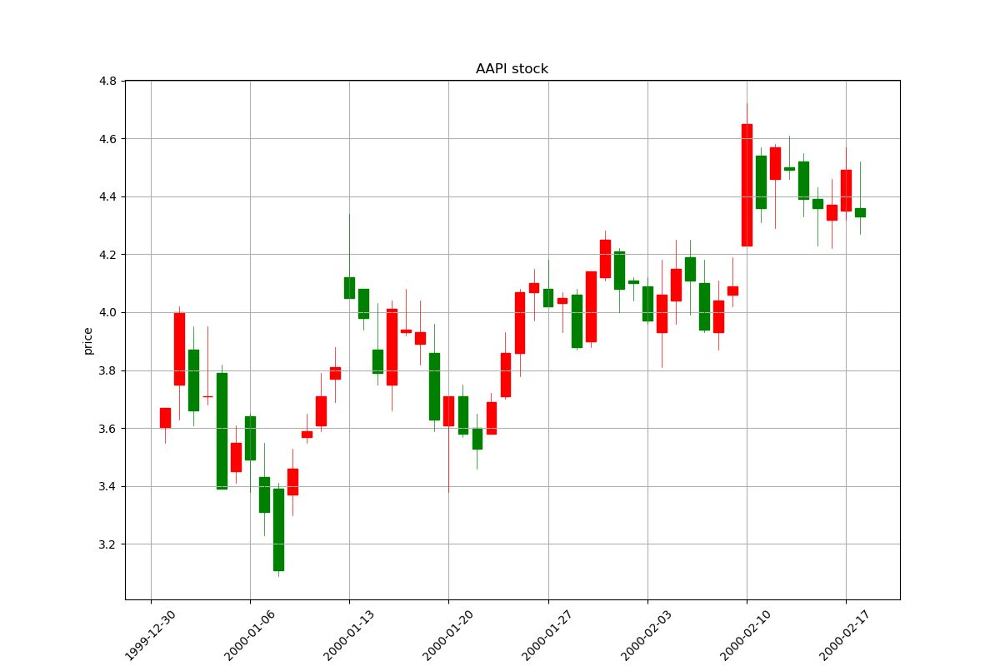

k线图，红色代表上涨，绿色代表下跌，柱形区域表示收盘价和开盘价，细线是最高价和最低价。

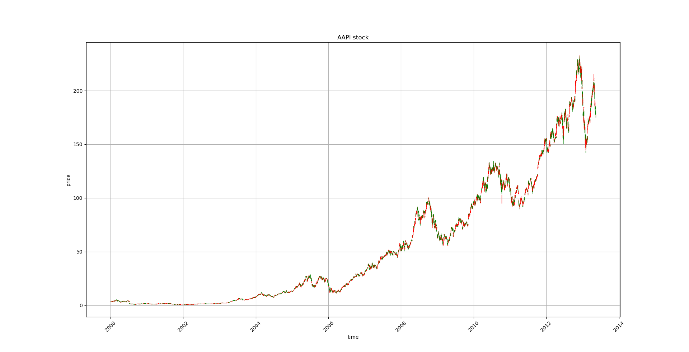
2000年-2019年总体数据图

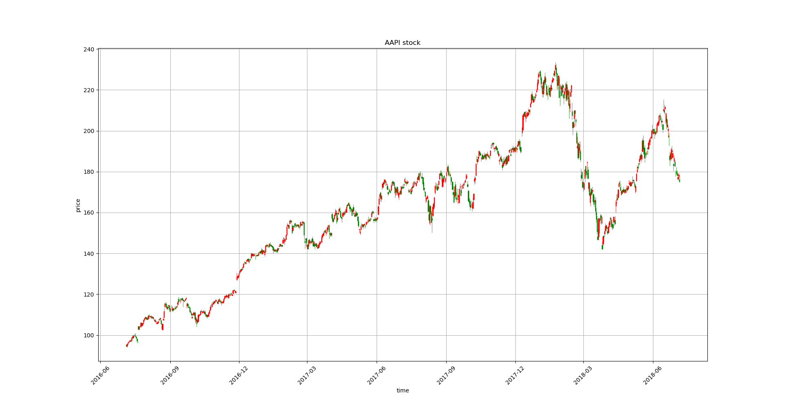
测试用数据图

</center>

## 2. 数据预处理
- 去噪声
  
&nbsp; &nbsp; &nbsp; &nbsp;任何给定的股票都与高波动性、小样本量、非平稳和非线性行为以及大量高噪声变量有关，这些都使得其分析变得困难。高噪声数据导致股票历史交易价格与未来价格之间存在不完全信息缺口。目前，当涉及到处理和消除金融数据的时候，行业标准是使用所谓的滑动平均值。虽然滑动平均值已被证明是处理数据的一种可行方法，但我们提出了一种通过小波去噪程序进行替换的方法，这将产生改进的结果。利用小波变换代替滑动平均值去噪股票信号，可以使金融数据更平滑，更准确地分解。

&nbsp; &nbsp; &nbsp; &nbsp;小波变换是一种数据分析技术，其中数据集被转换为小波域，并然后分成低频和高频部分。认为大部分数据的噪声都隐藏在小波域的高频部分。通过去噪程序，可以隔离和消除几乎每只股票中存在的许多不希望出现的噪声，所有这些噪声都有助于股票的波动性，但不一定表示股票的特征。

&nbsp; &nbsp; &nbsp; &nbsp;具体的做法是，先采用haar波形的小波变换
  $$X_{\omega}(a,b) = \frac{1}{\sqrt{a}}\int x(t)\psi \left(\frac{t-b}{a} \right) dt$$
  去除标准差以外的点，再做逆变换。
```
    (ca, cd) = pywt.dwt(x, "haar")
    cat = pywt.threshold(ca, np.std(ca), mode="soft")
    cdt = pywt.threshold(cd, np.std(cd), mode="soft")
    tx = pywt.idwt(cat, cdt, "haar")
```
&nbsp; &nbsp; &nbsp; &nbsp;下面的例子展示了小波变换和滑动平均对数据集的去除一个标准差以外的数据结果以及使用新的系数生成平滑后的数据结果。我们可以观察到，滑动平均去噪后的股票与小波去噪后的股票相比更平滑，但滑动平均去噪后的股票过度平滑。小波去噪生成的数据误差明显较小，提高了预测精度。

<center>
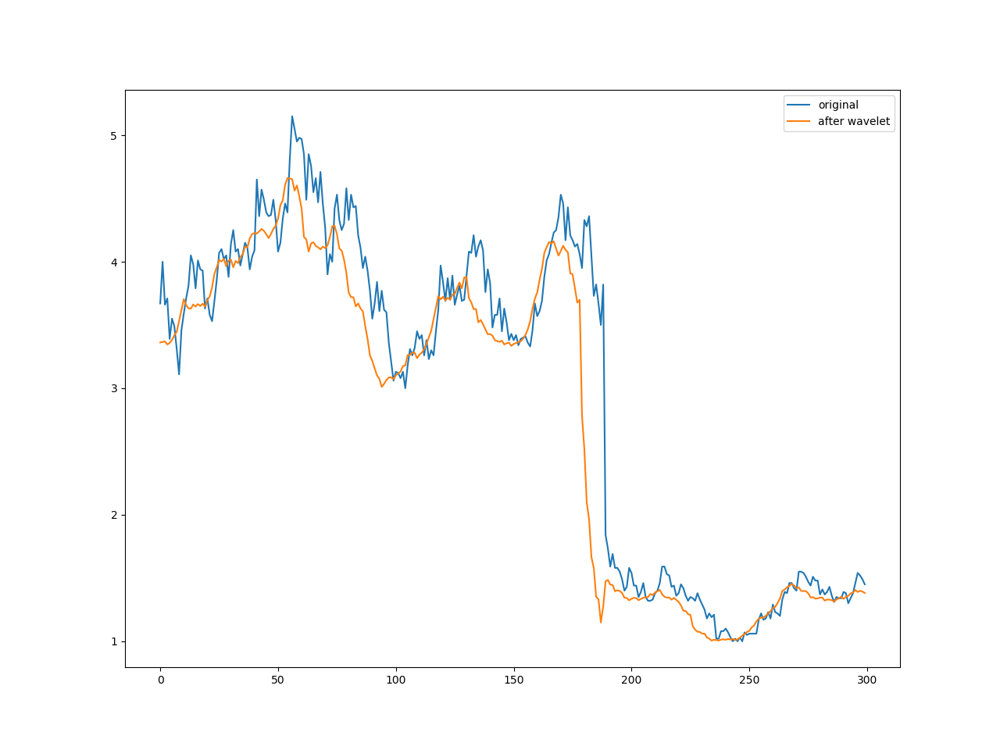

小波变换

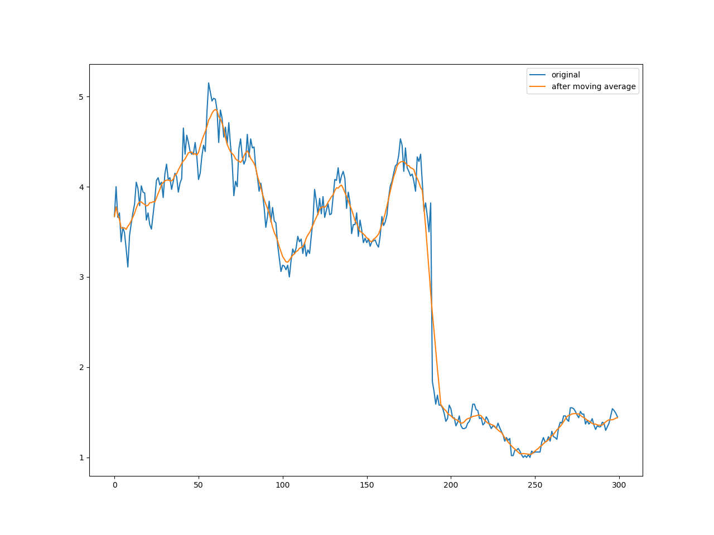

滑动平均

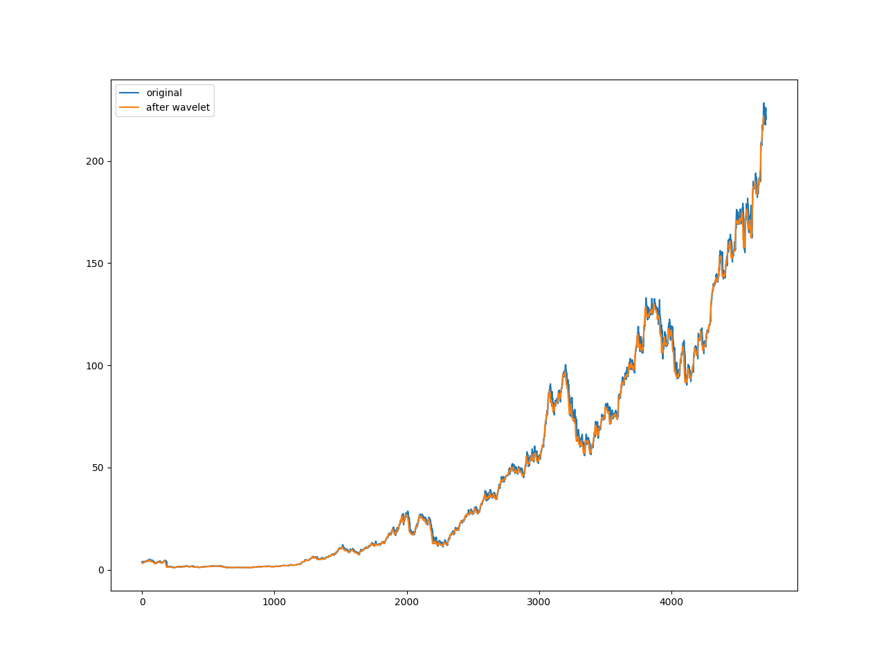

整体处理效果
</center>

- 数据使用及划分
  - 使用相邻之间股价差异的对数值作为训练和测试数据
  - 取开盘、收盘、最高、最低和调整后收盘价五种属性，取前十二天之间相邻两天的数据作为一组输入集，共55维。
  - 前1/4作为自编码器的训练数据
  - 后3/4的前80%为LSTM训练数据，后20%为测试集


## 3. 用栈式自编码器来提取特征
&nbsp; &nbsp; &nbsp; &nbsp;通常在机器学习中，往往需要利用领域知识来构建特征提取的方法，也可以使用受限玻尔兹曼机来自动提取特征。此项目采用的是栈式自编码器，由多个自编码器（自编码器是一种能够通过无监督学习，学到输入数据高效表示的人工神经网络。）堆叠而成，主要是考虑到栈式自编码器的可解释性更好。栈式自编码器把数据先从高维压缩到低维、然后再扩展到高维，这个过程的压缩部分就是很有效的一种特征提取的方法。此项目采用的栈式自编码器由3个自编码器级联构成。

<center>
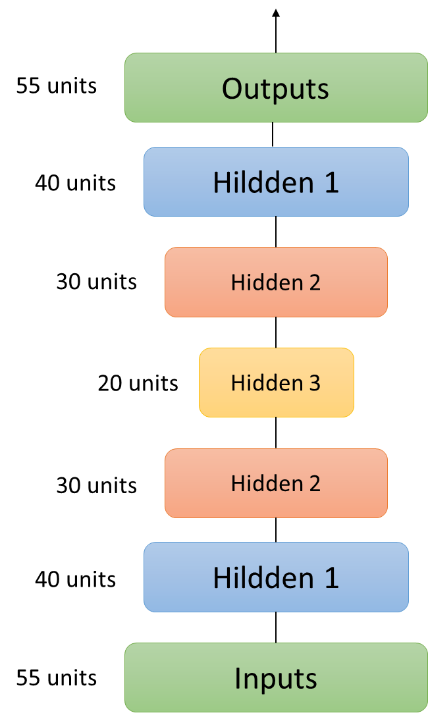


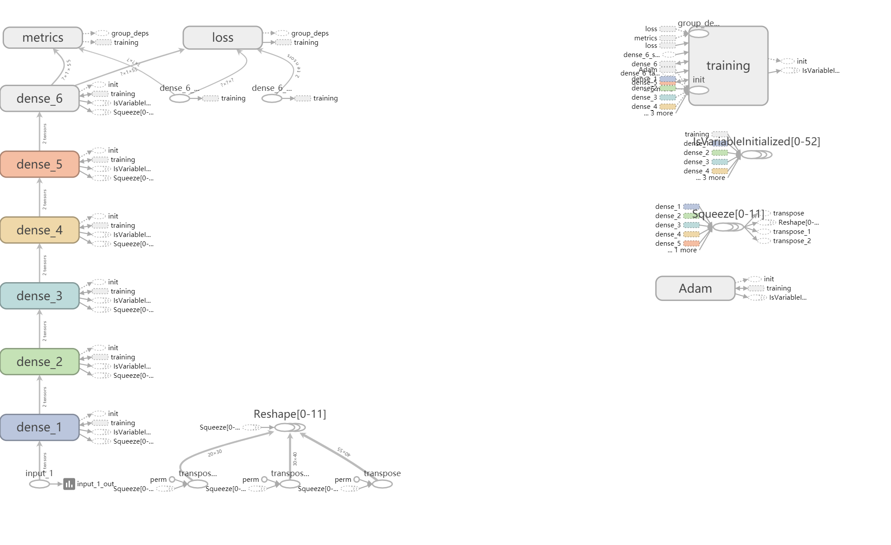
</center>

 输入是55维数据，提取特征后压缩为20维。

 ## 4. 训练LSTM模型
 &nbsp; &nbsp; &nbsp; &nbsp;LSTM是RNN的特殊类型，RNN由于梯度消失的原因只能有短期记忆，LSTM由于各种结构的cell和gate的存在将短期记忆与长期记忆结合起来，可以有效的捕捉相隔很远的两个node之间的关系，从而在时间序列的预测问题上效果非常好。
 - 训练模型特征如下
   - 20维特征值输入
   - 第一层LSTM输出5维，dense输出5维
   - 第二层LSTM输出2维，dense输出最终第二日收盘价差值的对数值
   - 每层采用L2正则化和drop_out方法
   - 优化方法为adam，动态调整学习率和梯度
   - 采用mean_square_loss作为损失函数


<center>
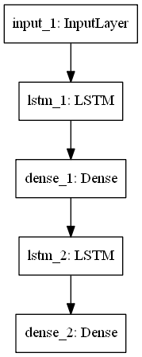


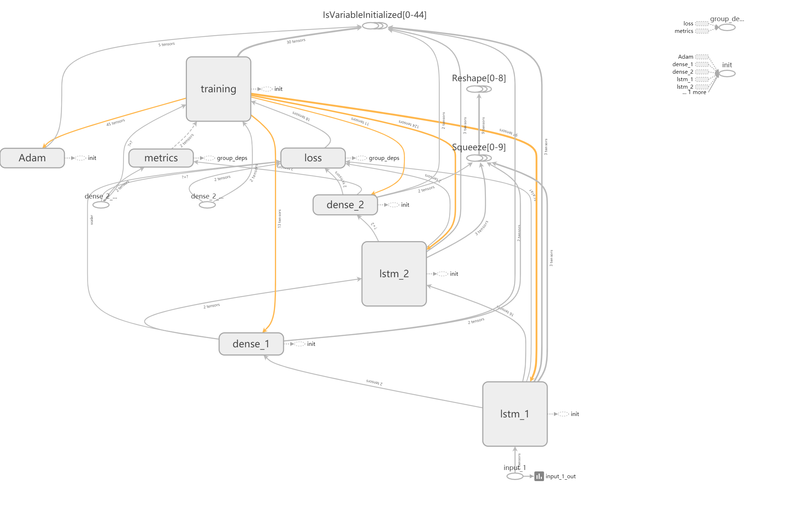
</center>

## 5. 训练结果
- 作为股票数据集，训练几乎不能提升测试集的准确率(accuracy)
  
<center>
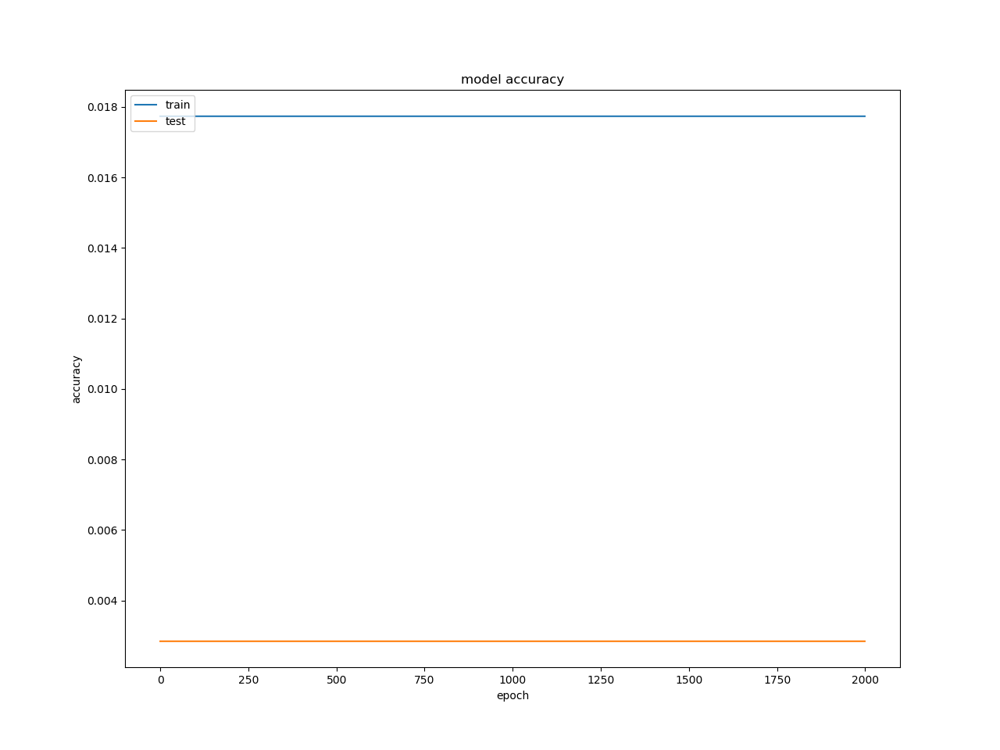
</center>

- 但是可以用mean_squared_error观测训练过程
  
<center>
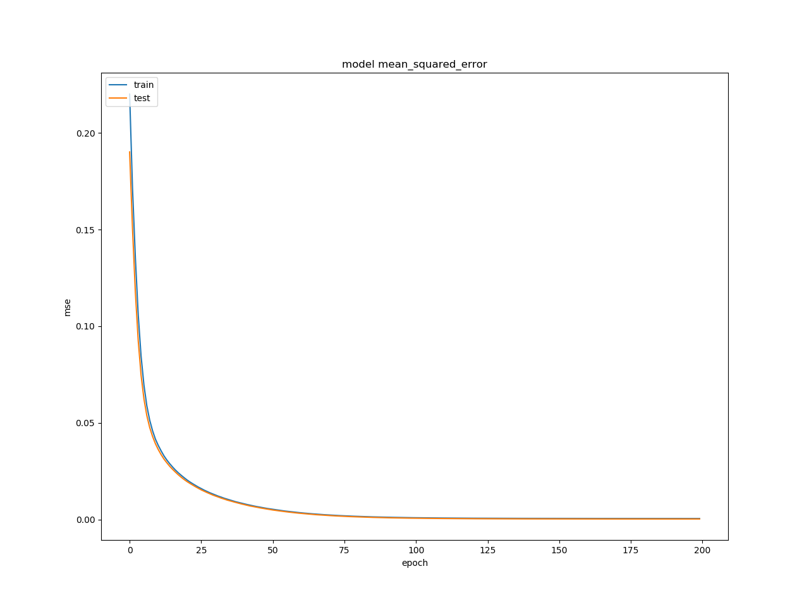
</center>

- 训练步长200步后，在测试集上第二天收盘股价对数值的预测和实际的对比图如下
  
 <center>
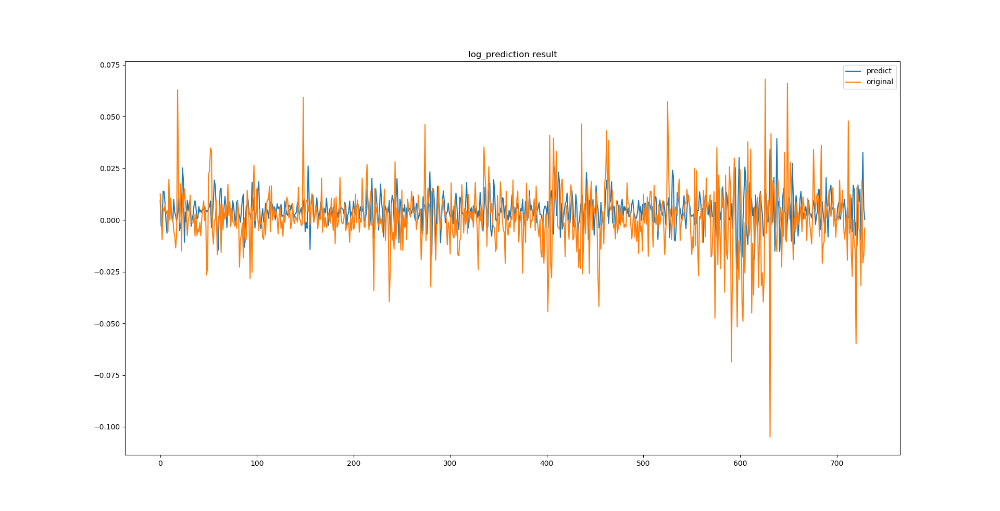
</center> 

- 反映为收盘股价对比图如下

 <center>
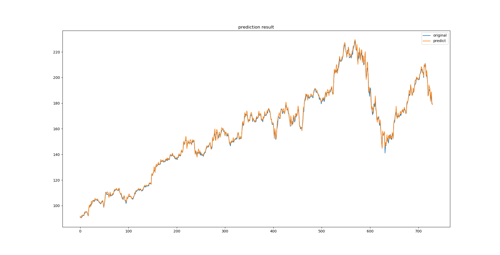
</center> 

- 训练50步，100步，200步对比图分别如下

 <center>
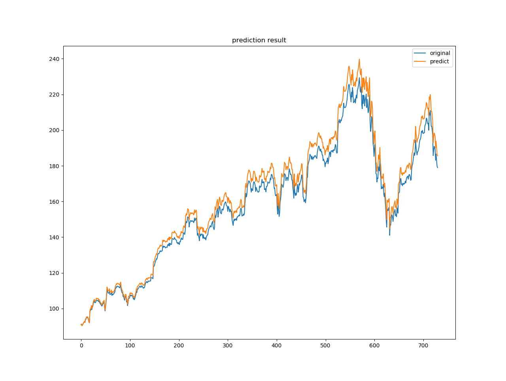
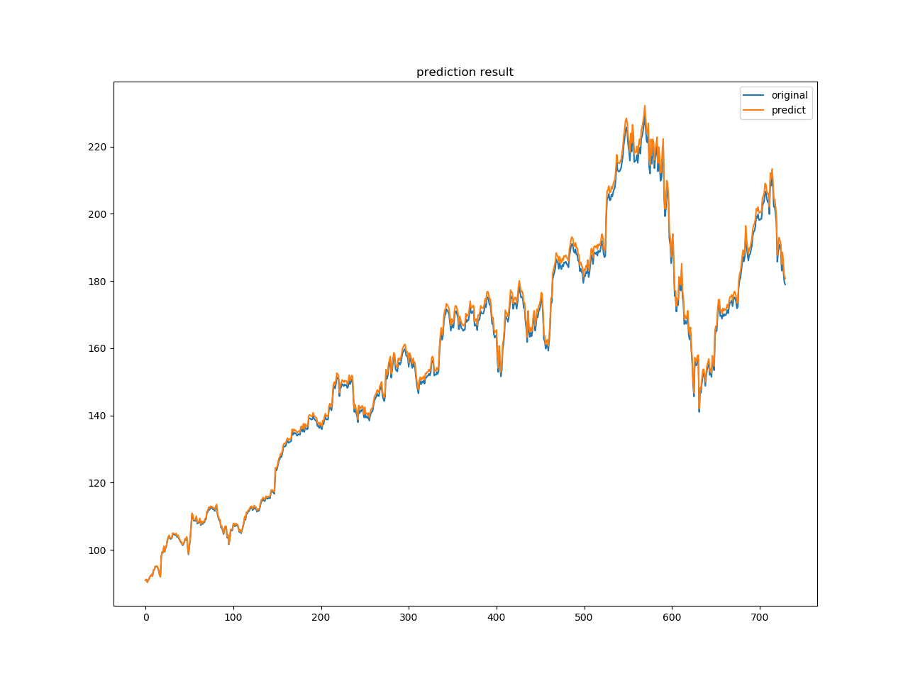
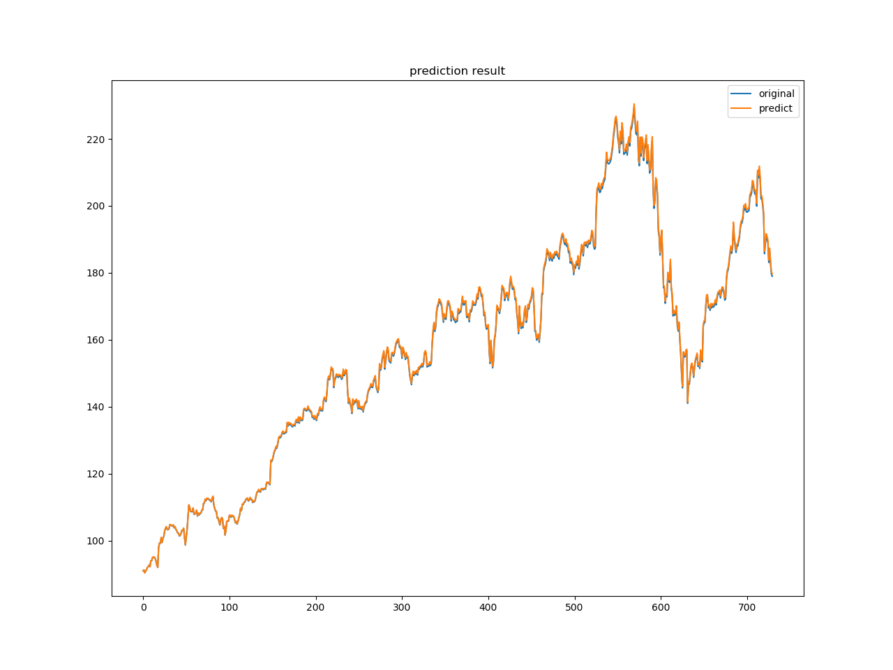
</center>  

## 6. 讨论

 &nbsp; &nbsp; &nbsp; &nbsp;该模型来源于论文 https://arxiv.org/abs/1904.08459。 事实上，在着手实现这个项目的时候，发现了该模型存在根本性的问题。
 - 首先，利用小波变换处理数据有利用未来数据的嫌疑，应当仅对训练集做处理，测试集不应当用小波变换处理。
 - 第二，使用mean_squared_error作为损失函数并不是一个很好的选择。事实上，在训练的时候我发现，使用更复杂的lstm模型会让预测值变的平凡，即**预测相对差值对数值趋近于0，即拿上一天的数据作为当天数据的预测值**，这显然是不妥的，但是由于我们训练的是变化值，这样的的确确会使mean_squared_error变得更小，而且由于作图时是基于前一天的数据画的，这样看起来预测的值和实际值也很接近，最终趋于下图这样。
  
 <center>

</center>  

 - 在完成这个模型后我暂时也没有更多的时间去研究更新的方法了。这个模型我认为就仅仅能当作是一个预测的玩具，对我本人来说也是一个深度学习入门级的练习。